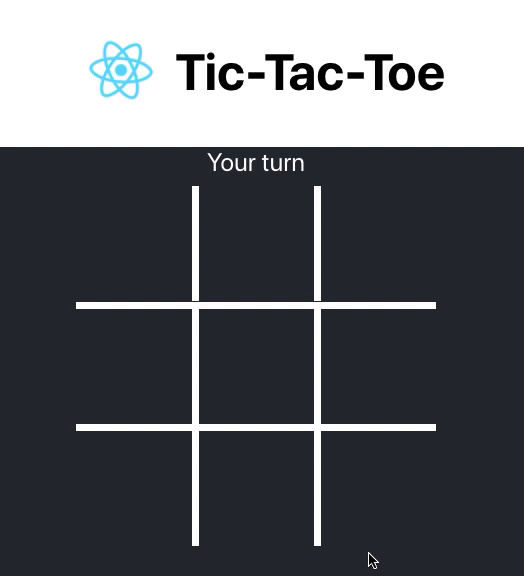
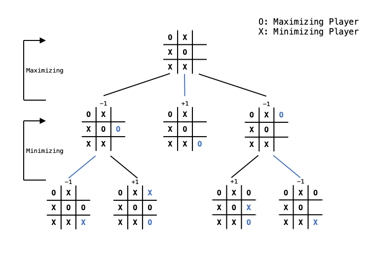

# Unbeatable-Tictactoe
unbeatable tictactoe using the minimax algorithm



## Minimax Algorithm

***Minimax*** is a kind of backtracking algorithm used in decision-making game theory. It calculates the optimal move, assuming that the opponent plays optimally.


There are two players in the minimax: ***Maximizing Player*** and ***Minimizing Player***.
The maximizing Player is the player who wants to win, and the minimizing player is the player who needs to lose, which is the opponent. In this game, AI is the maximizing player and the human player is the minimizing player. 

There are 3 final state in TicTacToe: **Win**, **Tie**, or **Lose**. This can be represented as scores. **+1** for **win**, **0** for **tie**, and **-1** for **lose**. To calculate the optimal move for the AI to make, you want to choose the move that results in the highest score for the AI and the lowest score for the human player. Refer to the diagram below.



For X's turn which is the minimizing player, you want to pick a move with the lowest score which sets the parent node's score to -1. For O's turn, you want to pick a move with the highest score, which is +1. Calculating the scores for all possible moves on every turn and maximizing or minimizing accordingly will result in the best move possible.

## Getting Started
clone or download this repository and run:
```
npm start
```

## Built With
* [React.js](https://reactjs.org/)
* [Create-React-App](https://github.com/facebook/create-react-app)

## References
* [Minimax Algorithm in Game Theory](https://www.geeksforgeeks.org/minimax-algorithm-in-game-theory-set-1-introduction/)
* [Algorithm Explained -  minimax and alpha-beta pruning](https://www.youtube.com/watch?v=l-hh51ncgDI)
* [Tic Tac Toe AI with Minimax Algorithm](https://www.youtube.com/watch?v=trKjYdBASyQ)
